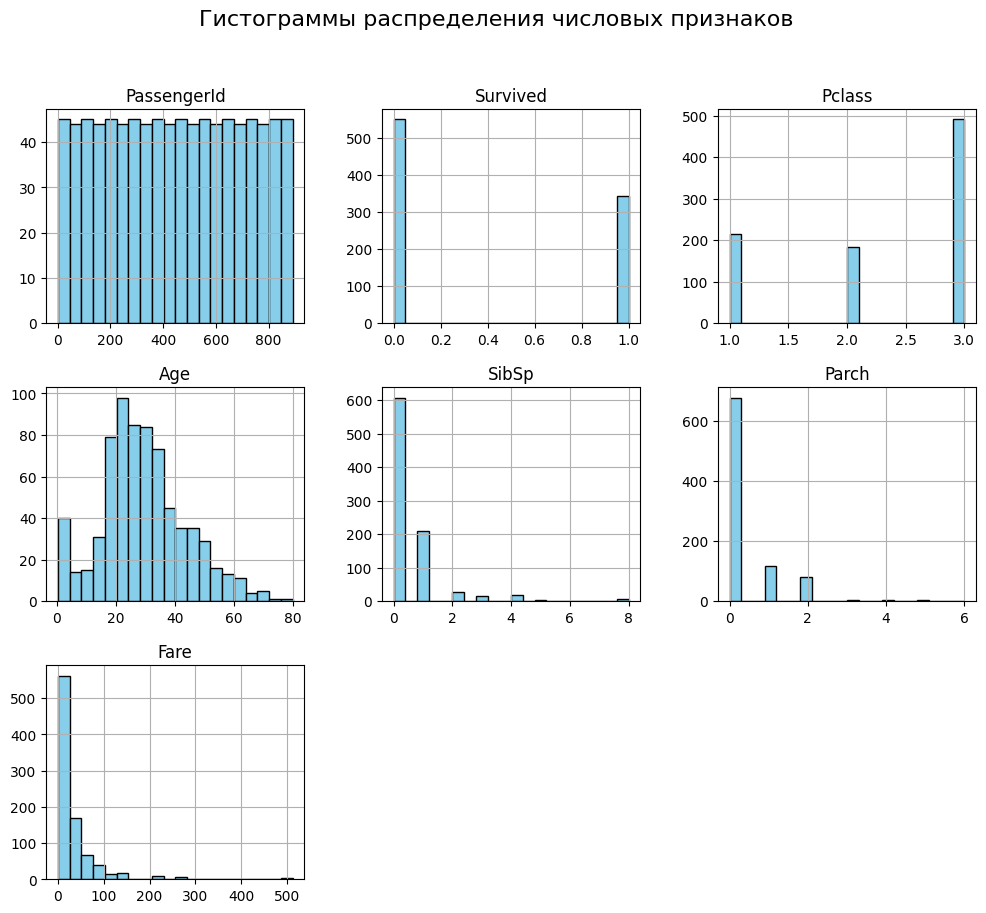
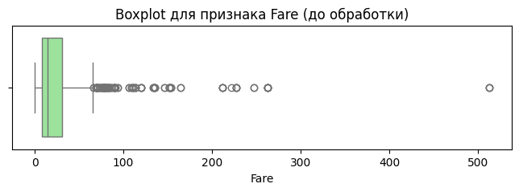
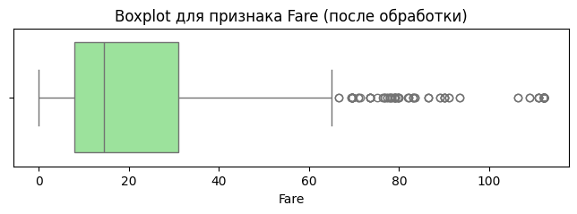
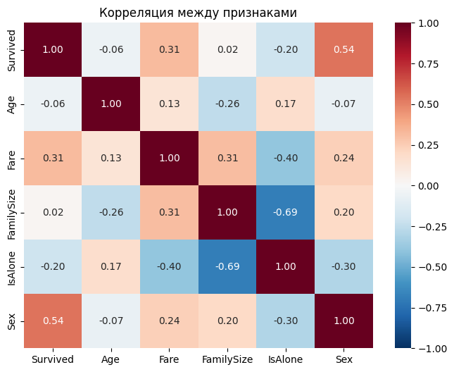

# Отчет об аналитике и обработке данных

[https://drive.google.com/file/d/1k13EBk44Z-wJFe5X3bxCVWxheREhCK3u/view?usp=sharing](https://drive.google.com/file/d/1k13EBk44Z-wJFe5X3bxCVWxheREhCK3u/view?usp=sharing)

**Тема:** Предобработка и первичный анализ данных (на примере датасета Titanic)

---

### Введение

Предобработка данных — критически важный этап в любом проекте по анализу данных или машинному обучению. Качество "сырых" данных редко позволяет сразу применять к ним алгоритмы: наличие пропусков, шумов, нечисловых форматов и выбросов может существенно исказить результаты моделирования. Данная работа посвящена полному циклу подготовки данных на классическом наборе данных пассажиров Титаника.

### Цель работы

Освоить основные методы предобработки данных с использованием библиотеки Pandas: проведение первичного анализа, очистку от пропусков, трансформацию и генерацию новых признаков (Feature Engineering), обработку выбросов, а также агрегацию данных для выявления первичных закономерностей.

---

### Описание набора данных

В работе используется набор данных **Titanic** (891 строка, 12 исходных столбцов).
*Целевая переменная:* `Survived` (0 — погиб, 1 — выжил).
*Ключевые признаки:* `Pclass` (класс билета), `Name`, `Sex`, `Age`, `SibSp` (братья/сестры/супруги), `Parch` (родители/дети), `Ticket`, `Fare` (стоимость билета), `Cabin` (каюта), `Embarked` (порт посадки).

---

### Первичный анализ

#### Статистика датафрейма

При первичном выводе информации (`df.info()` и `df.describe()`) были выявлены следующие особенности:

* Общее количество записей: 891.
* Средняя выживаемость составила около 38.4%.
* Средний возраст пассажиров — 29.7 лет (при этом есть младенцы 0.42 года и пожилые люди до 80 лет).
* Стоимость билета (`Fare`) сильно варьируется: от 0 до 512.32, что сразу указывает на наличие сильного скоса в данных и возможных выбросов.

{ width="auto"}

#### Визуализация и оценка пропусков

Анализ `df.isnull().sum()` показал наличие пропусков в трех столбцах:

1. `Age`: 177 пропусков (~20% данных).
2. `Cabin`: 687 пропусков (~77% данных).
3. `Embarked`: 2 пропуска (незначительное количество).

Построенные гистограммы распределения показали, что признак `Age` имеет распределение, близкое к нормальному (со смещением влево), а `Fare` — экспоненциально убывающее распределение.

---

### Обработка пропусков

#### Методы заполнения

1. **Признак Age:** Так как возраст является важным числовым признаком, удалять строки нельзя. Среднее значение (29.70) и медиана (28.0) оказались близки. Пропуски были заполнены **медианным значением (28.0)**, так как медиана более устойчива к выбросам.
2. **Признак Embarked:** Два пропуска были заполнены наиболее часто встречающимся значением (**модой** — порт 'S').
3. **Признак Cabin:** В связи с критическим числом пропусков (>75%), напрямую восстановить данные невозможно. Однако первая буква каюты обозначает палубу, что может влиять на выживаемость. Был создан новый признак `Deck` (палуба), пропуски в котором заполнены значением **'U' (Unknown)**. Исходный столбец `Cabin` был удален.

#### Результаты обработки

После применения описанных методов проверка показала **0 пустых значений** во всем датасете. Доля пропущенных ячеек снизилась с изначальных значений до 0.00%.

---

### Трансформация данных

Для адаптации данных под алгоритмы машинного обучения были произведены следующие преобразования:

#### Преобразования типов

* `Pclass` (класс билета) преобразован из числового (1, 2, 3) в категориальный строковый формат ('F', 'S', 'T').
* `Sex` (пол) закодирован в бинарный числовой формат: `male` -> 0, `female` -> 1.

#### Созданные признаки (Feature Engineering)

1. **`Age_group`**: Возраст разбит на 4 категории (Child, Teenager, Adult, Senior) с помощью `pd.cut()`.
2. **`Title`**: С помощью регулярных выражений из столбца `Name` извлечены титулы (Mr, Mrs, Miss, Master и др.). Это позволяет оценить социальный статус.
3. **`FamilySize`**: Вычислен размер семьи на борту (`SibSp` + `Parch` + 1).
4. **`IsAlone`**: Бинарный признак (1 — если `FamilySize` равен 1, иначе 0). Помогает понять, спасались ли одинокие пассажиры охотнее, чем те, кто искал семью.

---

### Обработка выбросов

#### Выявленные выбросы

Построенный график `boxplot` для признака `Fare` наглядно продемонстрировал наличие большого числа выбросов — билетов с аномально высокой стоимостью (вплоть до 512). Признак `Age` также имел экстремальные значения в зоне пожилого возраста (до 80 лет).

{ width="auto"}

#### Методы обработки

Для устранения негативного влияния выбросов без потери строк был применен метод **Winsorization (ограничение по перцентилю)**:

* Экстремальные значения стоимости билетов (`Fare`) были ограничены 95-м перцентилем. Максимальное значение снизилось с 512.32 до **112.08**.
* Возраст (`Age`) также ограничен 95-м перцентилем. Максимальный возраст в датасете снизился с 80 до **54.00** лет.
Повторный `boxplot` показал существенно более сжатое и пригодное для анализа распределение.

{ width="auto"}

---

### Агрегация и анализ

#### Сводные статистики и инсайты

Группировка данных позволила выявить четкие закономерности:

1. **Влияние класса:** Средняя выживаемость в 1-м классе ('F') составила **62.9%**, во 2-м ('S') — 47.2%, в 3-м ('T') — всего **24.2%**.
2. **Влияние пола и класса:** Наблюдается колоссальный разрыв в выживаемости мужчин и женщин. Женщины 1-го класса выживали в **96.8%** случаев, 2-го — в 92.1%. В то же время мужчины 3-го класса имели шанс на спасение лишь **13.5%**.
3. **Влияние размера семьи:** Сводная таблица по титулам и признаку `IsAlone` показала, что одинокие мужчины (`Mr` с `IsAlone=1`) выживали очень редко (~15%), тогда как наличие титула `Master` (мальчики/подростки) давало выживаемость около 57.5%.

#### Визуализации

Построенная **матрица корреляций (Heatmap)** числовых признаков математически подтвердила гипотезы:

* Сильнейшая положительная корреляция с `Survived` наблюдается у признака `Sex` (**0.54**), что отражает правило "женщины и дети первыми".
* Корреляция выживаемости и `Fare` равна **0.31** (пассажиры дорогих билетов выживали чаще).
* Признак `IsAlone` имеет отрицательную корреляцию с выживанием (**-0.20**).

{ width="auto"}

---

### Заключение

#### Результаты работы

1. Исходный датасет был успешно загружен, изучен и очищен.
2. Процент пропущенных данных (изначально достигавший 77% в отдельных столбцах) сведен к 0% путем медианного заполнения, замены на моду и константных значений.
3. Сгенерировано 5 новых признаков (`Age_group`, `Deck`, `Title`, `FamilySize`, `IsAlone`), которые значительно обогатили информативность данных.
4. Выбросы в числовых колонках устранены методом ограничения по 95-му перцентилю.
5. Итоговый датасет сохранен в файл `titanic_cleaned.csv`.

#### Выводы

В ходе работы было доказано, что грамотная предобработка позволяет извлечь из данных скрытую информацию. В частности, "сырой" столбец с именами не нес прямой пользы, но извлечение из него титула (`Title`) позволило выделить категорию статусных пассажиров и детей (`Master`), что сильно влияет на целевую переменную.
Агрегация и анализ матрицы корреляций подтвердили исторические факты: главными факторами выживания на Титанике были **пол пассажира, класс его билета и наличие семьи на борту**. Подготовленный набор данных теперь полностью готов к подаче на вход алгоритмам машинного обучения (деревья решений, логистическая регрессия и т.д.).